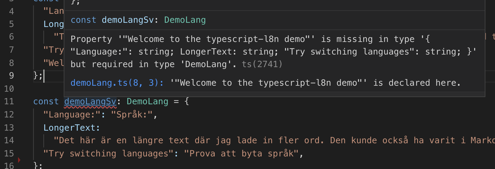

# typescript-l8n
A pattern for handling of localized strings in Typescript without adding any dependencies

## Author
Per Bergland
- https://github.com/perbergland
- https://linkedin.com/in/perbergland

## Description
This repo contains a small React-TS project that showcases a pattern for creation and usage of localized strings in Typescript code.

The main advantages of the pattern are

* No added dependencies (except for mustache but you can remove or replace it easily)
* The text in the base language is viewable where it's used
(you can also use text block identifiers where it makes more sense).


* Typescript compilation will fail if unknown strings are used or if you forget to add translation entries for one or more target languages. And you get code completion suggestions in IDE's like VSCode.





* The translation dictionaries are just javascript objects so you can use other tools for managing them if you want


## How to setup and use the typescript-l8n pattern

### Localization sections
Partition your user interface strings into a few names sections (this demo project has two: "admin" and "demo") and wire them together in the languageSections.ts file.

The pattern for a localization section is to use one language as the base and derive the type from the data
itself. For the base language, you can let the key be the value.

```
const demoLangEn = {
  "Language:": "",
  LongerText:
    "This is a longer text where I added more words. It could have been in Markdown and then converted to React nodes by some module.",
  "Try switching languages": "",
  "Welcome to the typescript-l8n demo": ""
};

export type DemoLang = { readonly [k in keyof typeof demoLangEn]: string };
export type DemoLangData = { readonly [k in SupportedUILanguage]: DemoLang };
```

next you define the other language maps using the derived type so that you get compile errors if the keys are not the same:
```
const demoLangSv: DemoLang = {
  "Language:": "Språk:",
  LongerText:
    "Det här är en längre text där jag lade in fler ord. Den kunde också ha varit i Markdown och sedan konverterats till React-noder av en plugin.",
  "Try switching languages": "Prova att byta språk",
  "Welcome to the typescript-l8n demo":
    "Välkommen till demon för typescript-l8n"
};
```

### languageSections to wire it all up
The [languageSections](src/locaalization/lib/languageSections.ts) file wires it all together by defining the sections and providing helper methods for getting to the data in type-safe ways.

```
export const LanguageSectionNames = tuple("demo", "admin");
export type LanguageSectionTuple = typeof LanguageSectionNames;
export type LanguageSection = LanguageSectionTuple[number];

export interface LanguageSections {
  readonly demo: DemoLangData;
  readonly admin: AdminLangData;
}

const getLanguageSection = <S extends LanguageSection>(
  section: S
): LanguageSections[S] => {
  switch (section) {
    case "demo":
      return getDemoLangData();
    case "admin":
      return getAdminLangData();
    default:
      return assertUnreachable(section);
  }
};
```

### UseLanguage or getLookupFunction
Once you have set up the languageSections fixture you can use the UseLanguage react component as shown in the App.tsx file here or just get the lookup function returned from getLookupFunction in your own method and use it like in the getLabelFromMethod example in App.tsx.

This is what it looks like when you use "UseLanguage". You just pass a function that takes a lookup function as argument as its only child and if you want strings from different sections you can just wrap multiple UseLanguage components. Both the _t and "lookup" functions below provide a typed interface to the data in the "demo" localization section.

```
  public render() {
    return (
      <UseLanguage section="demo" language={this.state.language}>
        {_t => (
            <div className="App">
            ...
              <h1 className="App-title">
                {_t("Welcome to the typescript-l8n demo")}
              </h1>
            ...
        }
        </UseLanguage>);
  }
``` 

```
const getLabelFromMethod = (language: SupportedUILanguage) => {
  const lookup = getLookupFunction("demo", language);
  return lookup("Try switching languages");
};
```

## Scaffolding

This project was initially set up using instructions from https://github.com/Microsoft/TypeScript-React-Starter

```
npm install -g create-react-app
create-react-app typescript-l8n --scripts-version=react-scripts-ts
```
